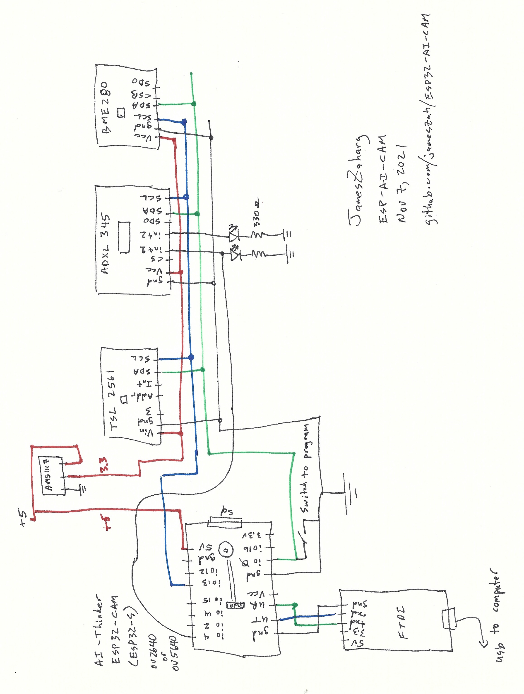

# ESP32-AI-CAM
ESP32-CAM with Microsoft Azure AI Computer Vision and Storage Blobs

This propgram uses an ESP32-CAM module, with several sensors attached with I2C, to take pictures with the original ov2640 2MP camera, or an ov5640 5MP camera, and then send the photo first to Microsoft Cloud Azure for computer vision analysis, returning its analysis of the picture, and then sends the picture to Azure Blob Storage, along with sensors readings date, time, temperature, pressure, humidity, and light level, which can be further analysed by Azure cloud level functions and databases.  A backup copy of all the pictures and data is stored on the SD card of the ESP32-CAM.  The current sensors are a BME280 for temperature, pressure, and humidity, and a TSL2561 for light.  An ADXL345 is used to wake up the ESP32-CAM whenever there is a tap or motion of the camera.  

See https://github.com/jameszah/ESP32-AI-CAM/tree/main/samples for some sample photos.  The first bunch are ov2640, and the last is ov5640.  The filename of the picture contains the meta-data in a json like format for the temperature, humidity, etc recorded at the time of the picture.  It is designed for more complicated functions than taking pictures of your phone!  The Azure computer vision got Mozart wrong, apparently Marcia Davenport had something to do with that painting.

More details coming on hardware and software installation and design.

## Hardware - simple

It is simpler than it looks.  Just 5v to ESP32, and 3.3v to all sensors, and ground everywhere.  Then use SDA/SCL as GPIO 13 and GPIO 0.  I hoped to use the 13 and 12, but the ESP32 uses the GPIO 12 for some sort boot strapping and must not be high on esp32 boot, and the SDA/SCL cannot be trusted on that.  So I re-used the GPIO 0, which can be be pulled low on boot to put the chip into programming mode.  Also GPIO 12, 13, and 4 are part of the SPI which drives the SD card, but if you put that SD interface into 1-bit mode in software, then those pins are avaialble.  GPIO 4 is also used by the ESP32-CAM module to drive the bright LED, and I also re-used it again to carry the interrupt from the ADXL to wake up the ESP32.  The interrupt is only used when the ESP32 is in deepsleep, so the LED will turn on after the interupt and before the ESP32 wakes up and shuts it off.  The SD card works fine with the GPIO 13 and GPIO 4 used for their other jobs -- but I have had a few cheap SD cards that have complained about all these signals on its unused data pins.  

The leds on the two ADXL interrupts are used to experiment with the board to see when the interupts trigger.  The diagram shows GPIO 4 wired to INT1 which the software sets up as a "motion" detector.  INT2 is set up as a "tap" detector.  You can fiddle with these if you are waiting for a door-knock to turn on the camera.

To program, power-off the ESP32, pull GPIO 0 to ground, then power-on the ESP32.

 

https://github.com/jameszah/ESP32-AI-CAM/blob/main/esp32-ai-cam.v12.jpg

## Hardware - better

Solder it all together - put the light sensor near the lense and put the temperature sensor away from the ESP32, and keep the anteanna of the ESP32 away from everything.

## Hardware - nice

List of pre-made parts from Adafruit that can be connected without soldering or breadbaords. (coming)

## Hardware - updates

Some possible changes to the hardware worth trying.

1.  Add a vibration sensor or reed switch to make a simpler method of waking up the ESP32.  
2.  Add an i2c real-time clock, so the ESP32 can get the time and start its work without first starting wifi to get the time.
3.  Add a i2c GPS module if your camera is going to be moving. (expensive)
4.  Add a i2c battery monitor to report battery capacity, and report it to Azure to alert a human to replace/rechange the battery.

## Software Installation

As of Nov 3, 2021:

Start with a normal Arduino installation (https://www.arduino.cc/en/software) - I am using Windows 10 with version 1.8.13 -- a few months old I think, as the current 1.8.16.

Install the esp32 board library (Tools ... Board ... Board Manager) -- I am using 1.0.6 -- a few months old I think, as the current is 2.0.0.

Next install the Arduino Librares (Tools ... Manage Libraries).

You need the following Azure libraries from Microsoft (all current):
   - AzureIoTHub by Microsoft 1.60
   - AzureIoTProtocol_HTTP by Microsoft 1.60
   - AzureIoTProtocol_MQTT by Microsoft 1.60
   - AzureIoTSocket_WiFi by Microsoft 1.02
   - AzureIoTUtility by Microsoft 1.61

And the following libraries from Sprakfun for the I2C sensors (all current):
   - SparkFun ADXL345 Arduino Library by SparkFun 1.0.0
   - SparkFun BME280 by SparkFun 2.0.9
   - SparkFun TSL2561 by Mike Grusin@SparkFun 1.1.0

And the JSON Library to unpack the response from Azure Computer Vision:
   - ArduinoJSON by Benoit Blanchon 6.16.1

That is all easy, but the complex part comes next.  This system uses the Azure IOTHub system which is designed to connect small sensors Azure to report temperatures and pressues which are small chunks of data.  But in the past it seems to have supported larger chunks of data, such as Blobs - Binary Large Objects.  Support for this seems to have disappeared, so to add it back, do the following.  You have to grab these two files:

https://github.com/Azure/azure-iot-arduino/blob/jbobotek-patch-1/src/blob.c   
https://github.com/Azure/azure-iot-arduino/blob/jbobotek-patch-1/src/blob.h   

... and store them in these folders.  This is for a "portable" version of the Arduino compiler, which lets you have multiple versions of the compiler on your computer.  (I'll figure out the pathnames for the regular install later.)

C:\ArduinoPortable\arduino-1.8.13\portable\sketchbook\libraries\AzureIoTHub\src\internal\blob.h   
C:\ArduinoPortable\arduino-1.8.13\portable\sketchbook\libraries\AzureIoTHub\src\blob.c    

And then re-start your Arduino system is always good advice.

Read more about the disappearance of the Arduino IOTHub blob functionality here:

https://github.com/Azure/azure-iot-arduino/issues/136

Another alternative is to use another Azure library called azure-sdk-for-c https://github.com/Azure/azure-sdk-for-c, where they are just in the process of re-adding blob support into that system https://github.com/Azure/azure-sdk-for-c/issues/1796.  It remains to be seen if that will fit into the memory available on the esp32, and whether this libcurl issue still has to be addressed.  https://github.com/Azure/azure-iot-arduino/issues/135#issue-1024008479

A previous version of the program had two channels to communicate with the IOTHub.  First there is the normal IOT channel which sends small packets of sensor data repeatedly to the hub (50 bytes or less), and second the BLOB upload which sends a jpeg (500,000 bytes).  But with the memory contraints of the ESP32, I could not run these two channels plus the camera all at the same time, so I removed the mqtt sensor upload, and just sent those 50 bytes along with the BLOB.  If you are doing lots of sensor updates, it would be worth re-introducing that simpler mqtt code.

## Compile Time Paramaters

The file settings.h contain the copile time parameters.

```
#define IOT_CONFIG_WIFI_SSID            "..."
#define IOT_CONFIG_WIFI_PASSWORD        "..."

/*String containing Hostname, Device Id & Device Key in the format:                         */
/*  "HostName=<host_name>;DeviceId=<device_id>;SharedAccessKey=<device_key>"                */
/*  "HostName=<host_name>;DeviceId=<device_id>;SharedAccessSignature=<device_sas_token>"    */
//static const char* connectionString = "[device connection string]";
static const char* connectionString = "HostName=myhubname.azure-devices.net;DeviceId=mydevicename;SharedAccessKey=............................................";

const char* host = "myazureregion.api.cognitive.microsoft.com"; 
const char* Ocp_Apim_Subscription_Key = "................................";
const int Port = 443;

#define ms_between_pictures 10000
#define number_of_pictures 2
```

You need your ssid name and password.

You need to setup an IOTHub on Azure and give it your IOTHub connection string and password for the Upload-to-blob function.

And finally you need to setup a Machine Vision function on Azure to to get the immediate photo analysis, and provide your local Azure site, and your subscription key.

Finally you can take several picture and store them in memory during a wakeup, and then send them all to Azure when they are done.  The final picture is sent to the machine vision for quick analysis, but all the pictures are uploaded to blob for analysis and your records at the Azure level.  So the final two parameters are the number of pictures, and the delay between pictures in mill-seconds.  You have to operate within the bounds of available psram memory.  The ESP32-CAM has 4MB or psram, and about 3MB is available for this function, and an indoor light scene (a little dull) should not use more the 512 kb for a ov5640 QSXGA 2560x1920 jpeg, so you can fit 5 probably.


## Azure Subscription and setting up Computer Vision, IOTHub, Blob Storage

You need a free Azure account to use this program.  You have to give your credit card to get a free account, which gives you most everything free for a month, including $200 of non-free stuff.  Plus you get a bunch of other things free for a year.  And another group of things free forever.  I didn't spend any of my $200 developing this, and the IOTHUb should be free forever.  The storage could start costing me something after a year, or sooner if you are taking 1000's of picture per day and storing them all, so keep an eye on your costs.

https://azure.microsoft.com/en-us/free/free-account-faq/

Within Azure, you have to set up the following.

1.  Resource Group within you local Azure region.
2.  IOTHub within you Resource Group and Azure region - an F1 free hub always multiple devices (ESP32-CAMs), and up to 8000 messages per day, for free, forever.
3.  Each ESP32-CAM must be set up as a "Devices" within that IOTHub, which will give you a connection string.
4.  Set up a Storage Account (within the resource group, within your Azure region), and then set up a Storage container within that Storage Account.
5.  Back in the IOTHub, you need to setup that Storage Account and Storaeg Container in "File Upload" section of the IOTHub.  The directory structure within the Stoage Container is set in the software.  The program creates a folder for everyday named "20211108" or YYYYMMDD, and then all the files within the container.
6.  Set up a Computer Vision account within Azure -- the free pricing tear gives you 20 per minute, and 5000 per month.

You can access the picture through the Storage Account and Storage Container, and the the name of the device (ESP32-CAM) and then the YYYYMMDD folder.  They are stored as BLOBs (binary large object) rather than the traditional file system.

An example filename:

```
jzLogger/20211103/{=camera=_=cam1=,=date=_=2021-11-03=,=time=_=05-01-12=,=temp=_=21.1=,=humid=_=36.8=,=press=_=089.4=,=lux=_=1214.1=,=reason=_=timer=,=seq=_=001=}.jpg
```
This file name is a modifed JSON.  If you replace all the equals with quotes ( = -> " ) and replace the underscores with colons ( _ -> : ), then you will get a proper JSON which can be used easily in any language.  But these quotes and colons do not work nicely in filenames and urls.

After that edit, you get the nice JSON here: 

jzLogger/20211103/  
{"camera":"cam1",  
"date":"2021-11-03",  
"time":"05-01-12",  
"temp":"21.1",   
"humid":"36.8",  
"press":"089.4",  
"lux":"1214.1",  
"reason":"timer",  
"seq":"001"}  
.jpg  

You get the sensor readings, plus the reason for the wakeup, and the sequence number of the multiple pictures per wakeup, and the name of the camera.  Plus the date for the folder, and the name of you IOTHub device.


## Software Enhancements

1.  Read the ssid/password, and IOTHub and Machine Vision connection String from the SD card, store them in esprom, and then delete the file from the SD card, so you can use idential software on all your ESP32-AI-CAM, and change the personality of the device just by putting a text file on the SD card, and rebooting the device.
2.  Delete old file from the SD card to make sure it does not fill up.  You could also add a function to upload old photos if there was a WiFi connection failure.
3.  Add the code for a battery monitor and report voltage in the normal sensor update. (see new hardware)

...

A few lines of code for the machine vision from here https://github.com/robotzero1/esp32cam-cognitive-scene
You can buy RobotZero a coffee over there.

Otherwize some demo programs from Sparkfun sensors and the Microsoft Azure IOT libraries.
