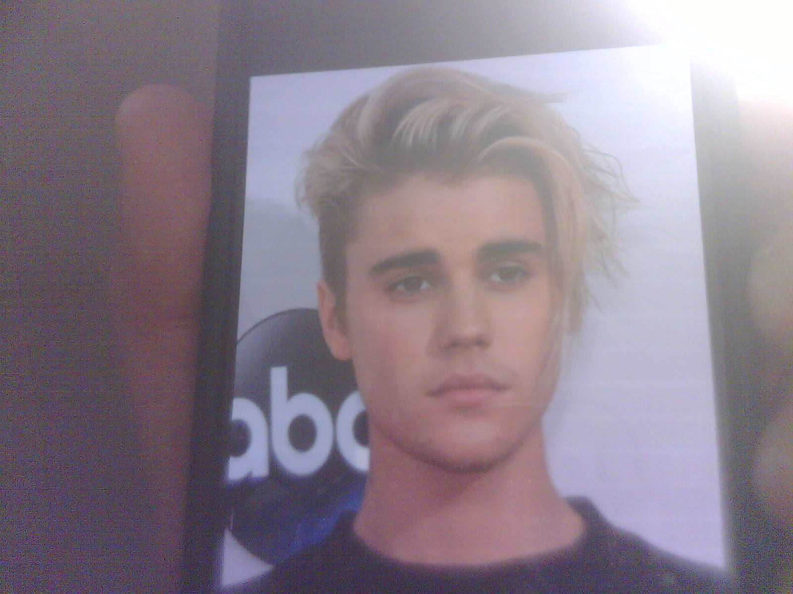
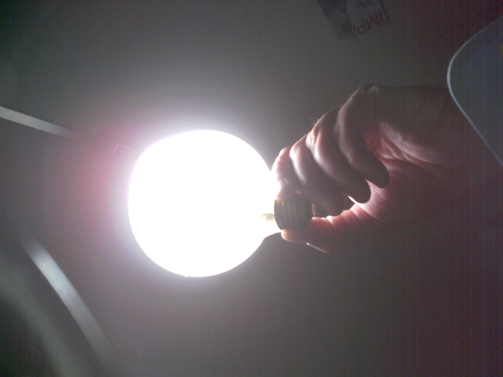

  

{=camera=_=cam1=,=date=_=2021-11-02=,=time=_=01-39-12=,=temp=_=23.4=,=humid=_=34.1=,=press=_=089.3=,=lux=_=048.3=,=reason=_=axdl3=,=seq=_=001=}.jpg

19:39:11.685 -> Connecting to canadacentral.api.cognitive.microsoft.com:443... Send 204000 bytes in 2.7 seconds for 598.7 kbps
19:39:16.046 -> 
19:39:16.984 -> {"description":{"tags":["text","person","indoor","staring"],"captions":[{"text":"Ludwig van Beethoven with long hair","confidence":0.41722583770751953}]},"requestId":"b7089b84-ac13-4163-a1d4-43cc289b85cb","metadata":{"height":1200,"width":1600,"format":"Jpeg"},"modelVersion":"2021-05-01"}
19:39:17.031 -> 

19:39:17.031 -> Azure Computer Vision says => **Ludwig van Beethoven with long hair., confidence= 41.7**

  

{=camera=_=cam1=,=date=_=2021-11-02=,=time=_=01-41-36=,=temp=_=23.3=,=humid=_=33.8=,=press=_=089.3=,=lux=_=048.3=,=reason=_=axdl3=,=seq=_=001=}.jpg

19:41:35.437 -> Connecting to canadacentral.api.cognitive.microsoft.com:443... Send 118636 bytes in 1.6 seconds for 604.1 kbps
19:41:38.907 -> 
19:41:39.797 -> {"description":{"tags":["person","wall","indoor"],"captions":[{"text":"Marcia Davenport taking a selfie","confidence":0.5297918915748596}]},"requestId":"60506c2c-f7a0-41a1-b4a1-0d99b51324f8","metadata":{"height":1200,"width":1600,"format":"Jpeg"},"modelVersion":"2021-05-01"}
19:41:39.797 -> 

19:41:39.797 -> Azure Computer Vision says => **Marcia Davenport taking a selfie., confidence= 53.0**

  

{=camera=_=cam1=,=date=_=2021-11-02=,=time=_=01-44-33=,=temp=_=23.4=,=humid=_=34.6=,=press=_=089.3=,=lux=_=049.3=,=reason=_=axdl3=,=seq=_=001=}.jpg

19:44:32.570 -> Connecting to canadacentral.api.cognitive.microsoft.com:443... Send 173763 bytes in 2.4 seconds for 581.4 kbps
19:44:36.789 -> 
19:44:37.539 -> {"description":{"tags":["person","wall","indoor","posing"],"captions":[{"text":"Justin Bieber with blonde hair","confidence":0.42162778973579407}]},"requestId":"47802270-e6f9-4f46-aaaf-e881be81189c","metadata":{"height":1200,"width":1600,"format":"Jpeg"},"modelVersion":"2021-05-01"}
19:44:37.539 -> 

19:44:37.539 -> Azure Computer Vision says => **Justin Bieber with blonde hair., confidence= 42.2**

  

{=camera=_=cam1=,=date=_=2021-11-02=,=time=_=01-47-07=,=temp=_=23.6=,=humid=_=34.9=,=press=_=089.3=,=lux=_=037.5=,=reason=_=axdl3=,=seq=_=001=}.jpg

19:47:06.755 -> Connecting to canadacentral.api.cognitive.microsoft.com:443... Send 191889 bytes in 2.6 seconds for 583.5 kbps
19:47:10.927 -> 
19:47:11.771 -> {"description":{"tags":["text","person"],"captions":[{"text":"Justin Trudeau holding a phone","confidence":0.33145245909690857}]},"requestId":"10dd2259-8706-4417-8c08-b8064a2f15fb","metadata":{"height":1200,"width":1600,"format":"Jpeg"},"modelVersion":"2021-05-01"}
19:47:11.818 -> 

19:47:11.818 -> Azure Computer Vision says => **Justin Trudeau holding a phone., confidence= 33.1**

  

{=camera=_=cam1=,=date=_=2021-11-02=,=time=_=01-57-36=,=temp=_=23.4=,=humid=_=35.3=,=press=_=089.3=,=lux=_=037.0=,=reason=_=axdl3=,=seq=_=001=}.jpg

19:57:35.821 -> Connecting to canadacentral.api.cognitive.microsoft.com:443... Send 197600 bytes in 2.9 seconds for 553.1 kbps
19:57:40.397 -> 
19:57:41.288 -> {"description":{"tags":["text","person"],"captions":[{"text":"Adele smiling for the camera","confidence":0.4976980984210968}]},"requestId":"a5600817-3511-4477-93a1-b2680698a7a7","metadata":{"height":1200,"width":1600,"format":"Jpeg"},"modelVersion":"2021-05-01"}
19:57:41.335 -> 

19:57:41.335 -> Azure Computer Vision says => **Adele smiling for the camera., confidence= 49.8**

  

{=camera=_=cam1=,=date=_=2021-11-02=,=time=_=04-42-20=,=temp=_=22.0=,=humid=_=35.4=,=press=_=089.1=,=lux=_=423.8=,=reason=_=axdl3=,=seq=_=001=}.jpg

22:42:19.825 -> Connecting to canadacentral.api.cognitive.microsoft.com:443... Send 361635 bytes in 5.2 seconds for 556.1 kbps
22:42:26.748 -> 
22:42:27.592 -> {"description":{"tags":["person","dark","light"],"captions":[{"text":"a hand holding a light bulb","confidence":0.5022373795509338}]},"requestId":"24ac95eb-a7e2-48de-8a96-837f4d031328","metadata":{"height":1920,"width":2560,"format":"Jpeg"},"modelVersion":"2021-05-01"}
22:42:27.639 -> 

22:42:27.639 -> Azure Computer Vision says => **a hand holding a light bulb., confidence= 50.2**
